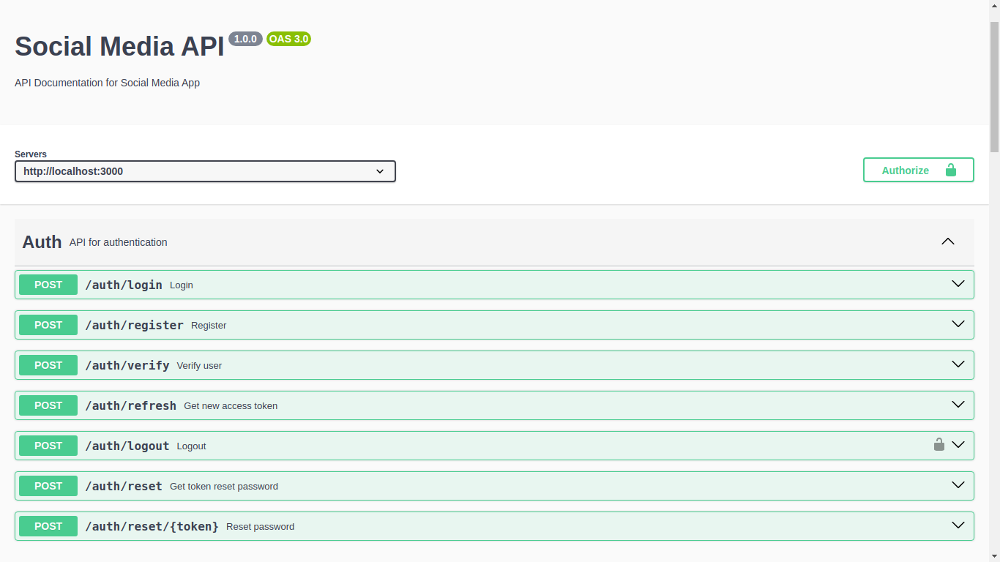
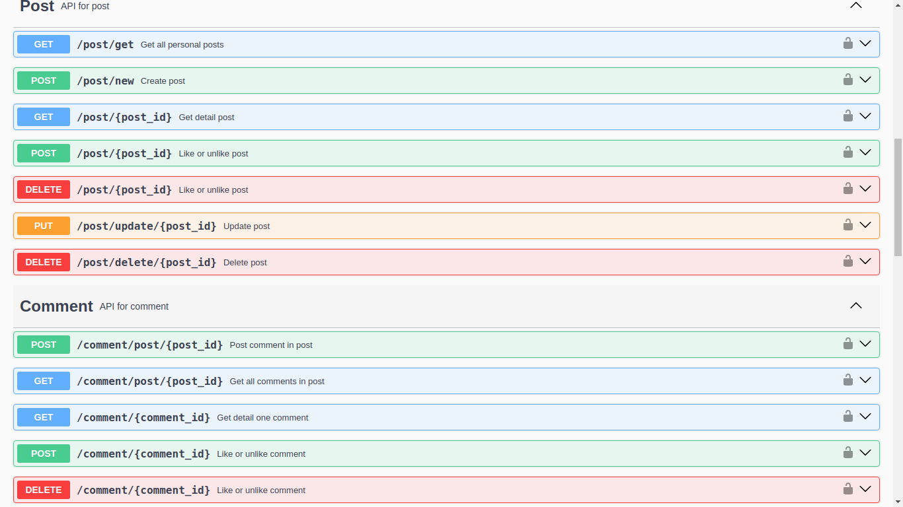

# Social Media Backend
## Installation
Run docker compose to create database Mysql

```shell
sudo docker compose up
```
Install package app
```shell
npm install
```
Start service
```shell
npm start
```
Below is the Swagger UI for the Social Media Backend API. Includes API parts: Auth, Post, Comment, Follow, Chat. Please try to install and explore my products 😉



